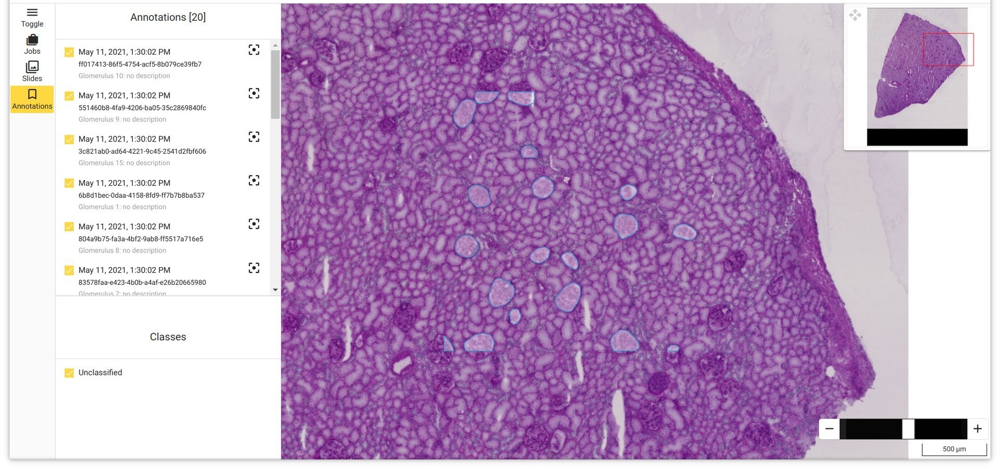

# EMPAIA Kidney Glomeruli Segmentation App 
[](https://doi.org/10.5281/zenodo.6208423)

A demonstrator application for the [EMPAIA Ecosystem for Digital Pathology](https://www.empaia.org/), as featured in [Romberg, D., Strohmenger, K., Jansen, C., Küster, T., Weiss, N., Geißler, C., ... & Homeyer, A. (2021). EMPAIA App Interface: An open and vendor-neutral interface for AI applications in pathology. Computer Methods and Programs in Biomedicine, 106596.](https://doi.org/10.1016/j.cmpb.2021.106596)

The API specification with which this app interacts can be found on [EMPAIA Developer Portal](https://developer.empaia.org/app_developer_docs/draft-3/#/)

The app wraps a segmentation model developed and trained by Tuguldur Erdene-Ochir (TU-Berlin) and Yuan Xu (TU-Berlin) for the Kaggle challenge [**HuBMAP: Hacking the Kidney** - Identify glomeruli in human kidney tissue images](https://www.kaggle.com/c/hubmap-kidney-segmentation):

> [The] challenge is to detect functional tissue units (FTUs) across different tissue preparation pipelines. An FTU is defined as a “three-dimensional block of cells centered around a capillary, such that each cell in this block is within diffusion distance from any other cell in the same block” (de Bo
no, 2013). The goal of this competition is the implementation of a successful and robust glomeruli FTU detector. &mdash; <cite>“HuBMAP - Hacking the Kidney.” Accessed February 28, 2021. https://kaggle.com/c/hubmap-kidney-segmentation.</cite>



### How to cite

> Evans, Theodore, & Karagül, Emirhan. (2022). EMPAIA Kidney Glomeruli Segmentation App (v1.0.0-stable). Zenodo. https://doi.org/10.5281/zenodo.6208423


<details><summary>BibTeX citation details</summary>

```
@software{evans_theodore_2022_6208423,
  author       = {Evans, Theodore and
                  Karagül, Emirhan},
  title        = {EMPAIA Kidney Glomeruli Segmentation App},
  month        = feb,
  year         = 2022,
  publisher    = {Zenodo},
  version      = {v1.0.0-stable},
  doi          = {10.5281/zenodo.6208423},
  url          = {https://doi.org/10.5281/zenodo.6208423}
}
```
</details>

Or refer to [Zenodo](https://doi.org/10.5281/zenodo.6208423) for more citation options.

## App details

- Clone the project `git clone git@gitlab.com:empaia/examples/kidney-glomeruli-segmentation-app.git`
- In the project directory, `docker build -t <image-tag> .` (requires internet access to download pre-trained model weights)
- A lightweight testing environment for the EMPAIA ecosystem can be run with the EMPAIA App Test Suite ([EATS](https://gitlab.com/empaia/integration/empaia-app-test-suite)). 
  - Refer to the [developer documentation](https://developer.empaia.org/app_developer_docs/draft-3/#/app_test_suite) for a step-by-step guide to starting EATS and running the app
  - Download the WSI `new_converted_kidney_bigtiles.tif` from [NextCloud](https://nextcloud.empaia.org/s/nfH2gQHiWknnCgQ) into to the data directory mounted by the EATS
  - You will need to provide the `ead.json` and your chosen `<image-tag>` when registering the app
  - Sample EATS input can be found in `./inputs`. Alternatively, the app can be parameterised and run from the Workbench Client.

## App details

### Model
* `hacking_kidney_16934_best_metric.model-384e1332.pth`
  * single fold/model kaggle LB: 0.873
  * input patch 1024x1024
  * semi supervised [UNet](https://arxiv.org/abs/1505.04597) with [SCSE](https://arxiv.org/abs/1803.02579) using Resnet34 as backbone: [unet.py](glomeruli_segmentation/model/unet.py)
  * example training parameters for supervised learning on 8 GPUs:
  ```
  python -m torch.distributed.launch --nproc_per_node 8 train.py --data-root /data/hubmap-kidney-segmentation --jobs=40 \
      --frozen-batchnorm=false --max-epochs=100 --pretrained=imagenet --batch-size-per-gpu=true --batch-size=20 --image-size=1024 --resize=1024 \
      --optim=adamw --learning-rate=3e-4 --weight-decay=0.0 --data-fold=0 --loss-ce=1 --loss-dice=0 --loss-lovasz=0 --apex-opt-level=O2 --sync-bn=True \
      --arch=unet_scse --backbone=Resnet34 \
      --data-aug-image-compression-p=0.3 \
      --data-aug-gauss-noise-p=0.3 \
      --data-aug-gaussian-blur-p=0.3 \
      --data-aug-rgb-aug-p=0.3 \
      --data-aug-color-jitter-p=0.4 \
      --data-aug-rotate-p=0.4 \
      --data-aug-random-scale-p=0.3 \
      --data-aug-clahe-p=0.2 \
      --data-aug-distort-p=0.7
  ```
 
### Training data

The model was trained on 13 TIFF files of 500MB - 5GB each, with metadata and annotations in polygon and RLE formats

 > [...] The HuBMAP data used in this hackathon includes 11 fresh frozen and 9 Formalin Fixed Paraffin Embedded (FFPE) PAS kidney images. Glomeruli FTU annotations exist for all 20 tissue samples; some of these will be shared for training, and others will be used to judge submissions.
> There are over 600,000 glomeruli in each human kidney (Nyengaard, 1992). Normal glomeruli typically range from 100-350μm in diameter with a roughly spherical shape (Kannan, 2019).  &mdash; <cite>“HuBMAP - Hacking the Kidney.” Accessed February 28, 2021. https://kaggle.com/c/hubmap-kidney-segmentation/data.</cite>

  Available from [**Kaggle**](https://www.kaggle.com/c/hubmap-kidney-segmentation/data):

  ```
  tree -L 1 /data/hubmap-kidney-segmentation
  /data/hubmap-kidney-segmentation
  ├── HuBMAP-20-dataset_information.csv
  ├── sample_submission.csv
  ├── test
  ├── train
  └── train.csv
  ```
  
