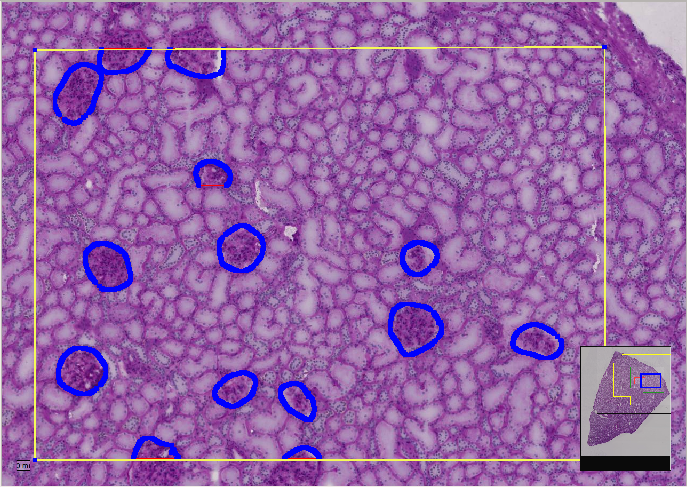
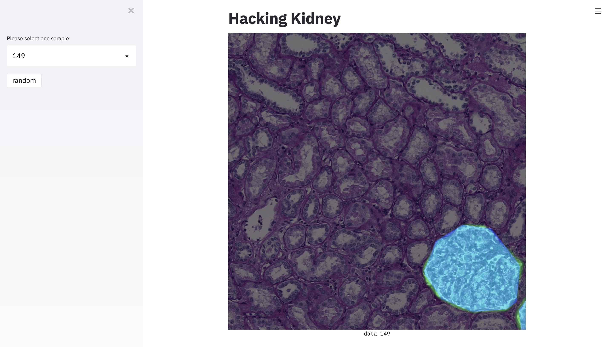

# HuBMAP Kidney Segmentation App

A demonstrator app derived from an inference model developed by Tuguldur Erdene-Ochir (TU-Berlin) and Yuan Xu (TU-Berlin) for submission to the Kaggle challenge [**HuBMAP: Hacking the Kidney** - Identify glomeruli in human kidney tissue images](https://www.kaggle.com/c/hubmap-kidney-segmentation). 

> [The] challenge is to detect functional tissue units (FTUs) across different tissue preparation pipelines. An FTU is defined as a “three-dimensional block of cells centered around a capillary, such that each cell in this block is within diffusion distance from any other cell in the same block” (de Bo
no, 2013). The goal of this competition is the implementation of a successful and robust glomeruli FTU detector. &mdash; <cite>“HuBMAP - Hacking the Kidney.” Accessed February 28, 2021. https://kaggle.com/c/hubmap-kidney-segmentation.</cite>

## App outputs visualised with [ASAP](https://github.com/GeertLitjens/ASAP)



## Training Data

 > [...] The HuBMAP data used in this hackathon includes 11 fresh frozen and 9 Formalin Fixed Paraffin Embedded (FFPE) PAS kidney images. Glomeruli FTU annotations exist for all 20 tissue samples; some of these will be shared for training, and others will be used to judge submissions.
> There are over 600,000 glomeruli in each human kidney (Nyengaard, 1992). Normal glomeruli typically range from 100-350μm in diameter with a roughly spherical shape (Kannan, 2019).  &mdash; <cite>“HuBMAP - Hacking the Kidney.” Accessed February 28, 2021. https://kaggle.com/c/hubmap-kidney-segmentation/data.</cite>

  **Download from** [**Kaggle**](https://www.kaggle.com/c/hubmap-kidney-segmentation/data) and ensure that the directory contains the following files:

  ```
  tree -L 1 /data/hubmap-kidney-segmentation
  /data/hubmap-kidney-segmentation
  ├── HuBMAP-20-dataset_information.csv
  ├── sample_submission.csv
  ├── test
  ├── train
  └── train.csv
  ```
  
* The model was trained on 13 TIFF files of 500MB - 5GB each, with metadata and annotations in polygon and RLE formats

## Model
  **Download from** [**NextCloud**](https://nx9836.your-storageshare.de/s/HSq8StKLB6WYncy). Email <theodore.evans@dai-labor.de> for access. **Do not distribute.**
* `hacking_kidney_16934_best_metric.model-384e1332.pth`
  * single fold/model kaggle LB: 0.873
  * input patch 1024x1024
  * semi supervised [UNet](https://arxiv.org/abs/1505.04597) with [SCSE](https://arxiv.org/abs/1803.02579) using Resnet34 as backbone: [nn/unet.py](nn/unet.py)
  * example training parameters for supervised learning on 8 GPUs:
  ```
  python -m torch.distributed.launch --nproc_per_node 8 train.py --data-root /data/hubmap-kidney-segmentation --jobs=40 \
      --frozen-batchnorm=false --max-epochs=100 --pretrained=imagenet --batch-size-per-gpu=true --batch-size=20 --image-size=1024 --resize=1024 \
      --optim=adamw --learning-rate=3e-4 --weight-decay=0.0 --data-fold=0 --loss-ce=1 --loss-dice=0 --loss-lovasz=0 --apex-opt-level=O2 --sync-bn=True \
      --arch=unet_scse --backbone=Resnet34 \
      --data-aug-image-compression-p=0.3 \
      --data-aug-gauss-noise-p=0.3 \
      --data-aug-gaussian-blur-p=0.3 \
      --data-aug-rgb-aug-p=0.3 \
      --data-aug-color-jitter-p=0.4 \
      --data-aug-rotate-p=0.4 \
      --data-aug-random-scale-p=0.3 \
      --data-aug-clahe-p=0.2 \
      --data-aug-distort-p=0.7
  ```

# Demo

A Streamlit demo visualizes the validation dataset overlaid with predictions and annotations.
```
streamlit run demo.py -- --image-size=1024 --mode=valid --model hacking_kidney_16934_best_metric.model-384e1332.pth
``` 



## Requirements

 * Running the demo in a Docker container is recommended. This requires Docker to be installed on the host machine.
 * The scripts in this repository require a Bash shell.

## Run demo with Docker (recommended)
1. Download the HuBMAP data (default directory: `./data/hubmap-kidney-segmentation`)
2. Download the model (default directory: project folder).
3. Run the starter script, building the Docker image when prompted. Optional arguments may be provided if data or model are located in non-default directories, or if a non-default Docker image tag should be used (default `$USER-hacking-kidney`). You may need to make the script executable using `chmod a+x start_container.sh`.
  ```bash
  ./start_container.sh [-d data_path] [-m model_path] [-i docker_image_tag] demo
  ```

5. Access the UI on `http://localhost:8501/` or `http://<server address>:8501/`

## Run demo without Docker
1. Download the data to `./data/hubmap-kidney-segmentation`
2. Download the model into the project directory
3. Install Anaconda and use the provided environment:
  ```bash
  conda env create -f environment.yml
  conda activate hacking_kidney
  ```
4. Run the streamlit demo 
  ```bash
  streamlit run demo.py -- --image-size=1024 --mode=valid --model hacking_kidney_16934_best_metric.model-384e1332.pth
  ```
5. Access the UI on `http://localhost:8501/`
